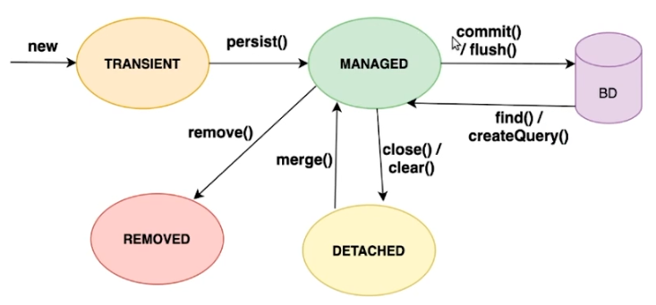

# Persistência com JPA: Hibernate


## Aula 1: Começando com JPA

- As desvantagens de se utilizar o JDBC para acessar bancos de dados em Java;
- A história de criação do Hibernate e da JPA;
- Como criar uma aplicação Maven e adicionar o Hibernate como dependência.

**Para desabilitar os logs da JPA (log4j), utilize:**

```
java.util.logging.Logger.getLogger("org.hibernate").setLevel(Level.SEVERE);
```

## Aula 2: Configurações e EntityManager 

- Como configurar a JPA via arquivo persistence.xml;
- Como mapear entidades JPA;
- Como utilizar o EntityManager para persistir entidades no banco de dados.

## Aula 3: Mapeando entidades 

- Como escrever uma classe DAO utilizando a JPA;
- Como mapear atributos do tipo Enum em uma entidade;
- Como mapear um relacionamento entre entidades.

## Aula 4: Ciclo de vida de uma entidade 

- Como funciona o ciclo de vida de entidades JPA;
- As transições de estados de uma entidade ao ser persistida;
- As transições de estados de uma entidade ao ser atualizada;
- As transições de estados de uma entidade ao ser removida.

### Ciclo de vida de uma entidade JPA



- **transient**: nunca foi persistida, não possui um estado e nem está sendo gerenciado pela JPA.
- **managed**: após o `persist()`. principal estado de uma  entidade e tudo que acontecer com a entidade, a JPA poderá atualizar no banco de dados. Após o commit, que finaliza a transação, ou o flush, que também persiste mas não finaliza a transação, as alterações serão gravadas no banco de dados.
- **detached**:  após o `close()` ou o `clear()`. A entidade/objeto não é mais gerenciada pela JPA, e quaisquer alterações realizadas não serão refletidas no banco de dados.
- **removed**:  após o `remove()`. A entidade é removida do managed e banco de dados. 

## Aula 5: Consultas com JPQL

- Como realizar consultas com o método find do Entity Manager;
- Como realizar consultas JPQL;
- Como filtrar dados em consultas JPQL;
- Como retornar apenas parte de uma entidade em uma consulta JPQL.